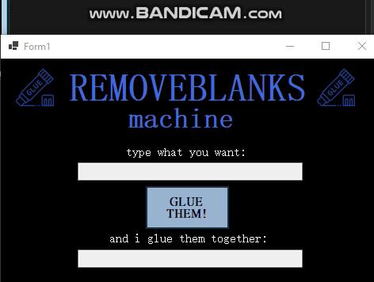

#🧹 Blanks Remover — My Form-Based String Processor in C#  
A beginner-friendly Windows Forms application created to clean up text input.  
Built during my journey into programming and interactive software design ✨  

#💡 What it does  
Enter any text into the input box and click the button—  
It automatically removes all spaces and returns a neat, compressed string.
As you think it glue them toghether.

#🎯 Why it matters  
This project helped me understand string manipulation, loops, and basic conditionals.  
It’s a visual way to see how user input can be transformed through custom logic.  

#🔧 Technologies used  
💻 Language: C#  
🖥️ Framework: Windows Forms  
🛠️ Environment: Visual Studio  

#📸 Demo  

#📁 Download and Run  
To try the project:  
1. Clone this repository  
2. Open the `.sln` file in Visual Studio  
3. Press Start to run the form  

#🙋‍♀️ About Me  
I’m a computer engineering student who blends creativity and code—  
Passionate about making digital experiences intuitive and delightful ✨  
